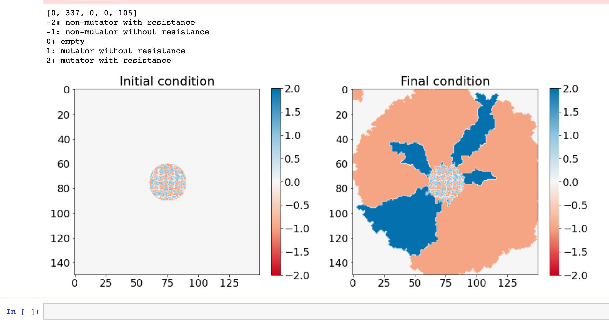

# Cell Simulation

A cellular automaton-type simulation in python. This code allowed me to simulate spatially extended competition dynamics between mutator and non-mutator strains with different assumptions about mutation rates and beneficial mutations that might be realized in experiments. In the event that the simulation and practical experiment results align, we hope to confirm that the model is sufficiently robust and incorporates variables that successfully explain evolvability in yeast.

